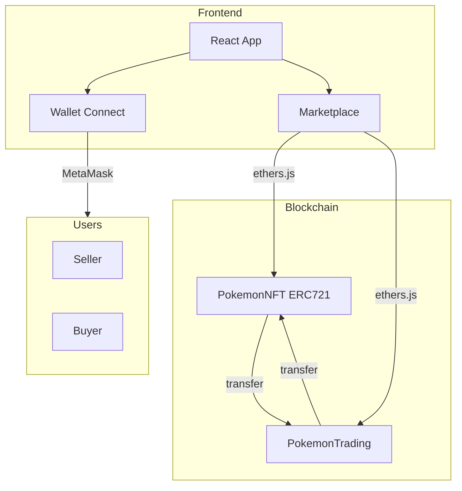

# PokeOne - Decentralized Pokémon Card Trading Platform

UCL DeFi Coursework 1: A decentralized application (dApp) for trading Pokémon cards on a local Ethereum testnet.

## Features

- **ERC721 NFT Contract**: Pokémon cards with on-chain metadata (name, type, HP, attack, defense, rarity)
- **Trading Contract**: Fixed-price sales and English auctions
- **Security**: ReentrancyGuard, Pausable, Ownable, pull-over-push withdrawals, minimum bid increment (front-running mitigation)
- **Frontend**: React app with wallet connection, marketplace, and trading interfaces

## Prerequisites

- Node.js 18+
- MetaMask (or compatible wallet)
- npm or yarn

## Setup

### 1. Install Dependencies

```bash
npm install
cd frontend && npm install && cd ..
```

### 2. Compile Contracts

```bash
npm run compile
```

### 3. Run Local Testnet

In one terminal:

```bash
npm run node
```

### 4. Deploy Contracts

In another terminal:

```bash
npm run deploy
```

Save the output addresses for the frontend.

### 5. Configure Frontend

Create `frontend/.env`:

```
VITE_POKEMON_NFT_ADDRESS=<PokemonNFT address from deploy>
VITE_POKEMON_TRADING_ADDRESS=<PokemonTrading address from deploy>
```

### 6. Add MetaMask Network

- Network Name: Hardhat Local
- RPC URL: http://127.0.0.1:8545
- Chain ID: 31337
- Currency: ETH

Import a test account (use a private key from the Hardhat node output).

### 7. Run Frontend

```bash
cd frontend && npm run dev
```

Open http://localhost:3000

### 8. Seed Demo Cards (Optional)

The deployer is the NFT owner. Mint cards via the "Mint Pokemon Card" section in the UI, or run:

```bash
set POKEMON_NFT_ADDRESS=<nft-address>
npx hardhat run scripts/seed.js --network localhost
```

## Project Structure

```
Pokeone/
├── contracts/
│   ├── PokemonNFT.sol       # ERC721 Pokémon cards
│   └── PokemonTrading.sol   # Fixed-price + auction trading
├── scripts/
│   ├── deploy.js
│   └── seed.js
├── test/
│   ├── PokemonNFT.test.js
│   └── PokemonTrading.test.js
├── frontend/                # React + Vite
│   ├── src/
│   │   ├── components/
│   │   ├── hooks/
│   │   └── config.js
│   └── .env.example
├── hardhat.config.js
└── README.md
```

## Architecture



### Smart Contracts

- **PokemonNFT**: ERC721 with URI storage, Ownable, Pausable. Owner mints cards with metadata.
- **PokemonTrading**: Accepts NFT transfers for listing. Implements fixed-price `buyCard` and auction `placeBid`/`settleAuction`. Uses pull-over-push for secure withdrawals.

### Security Measures

- **ReentrancyGuard**: On all state-changing functions in PokemonTrading
- **Pausable**: Emergency stop on both contracts
- **Ownable**: Restricted minting to owner
- **Pull-over-push**: Sellers withdraw via `withdraw()` instead of direct transfers
- **Front-running mitigation**: 5% minimum bid increment on auctions
- **Integer overflow**: Solidity 0.8.x built-in checks

## Testing

```bash
npm test
```

## Scripts

| Script        | Description                    |
|---------------|--------------------------------|
| `npm run compile` | Compile Solidity contracts |
| `npm run test`    | Run test suite            |
| `npm run node`    | Start Hardhat local node  |
| `npm run deploy`  | Deploy to localhost       |

## Demo Video

A 3-minute demo video is required for submission. Record the following:

1. Wallet connection
2. Minting a card (as owner)
3. Listing a card for fixed price
4. Buying a card
5. Starting an auction and placing a bid
6. Settling an auction
7. Withdrawing proceeds

## License

ISC
